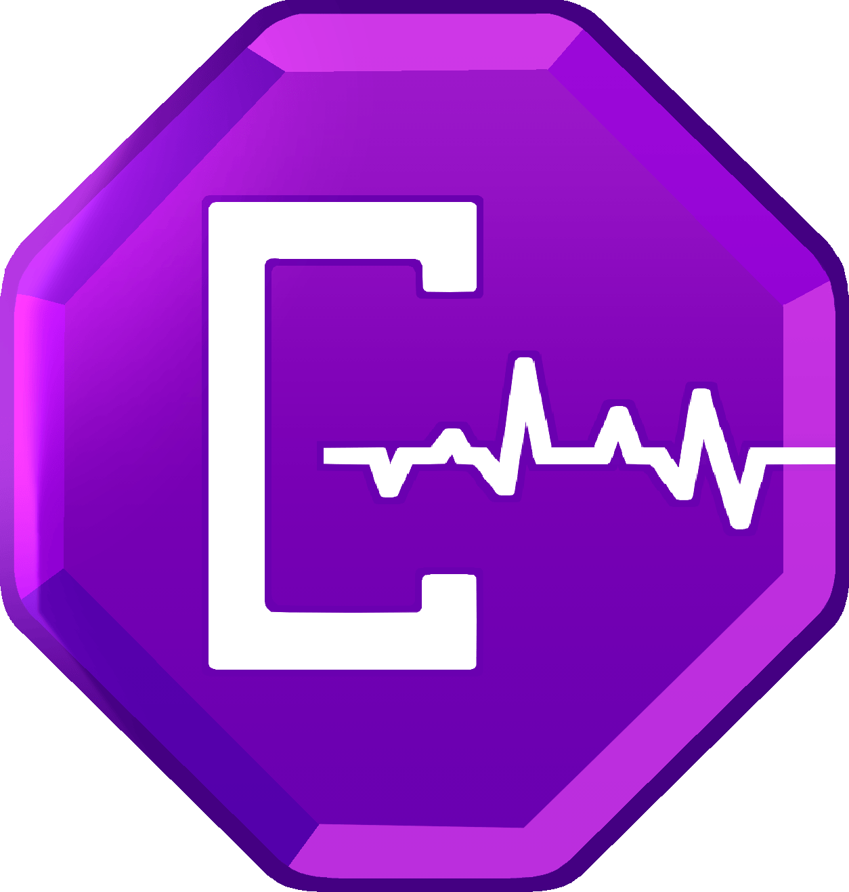

# CodePulse

<p align="center">
  
</p>

A code quality and bug prediction dashboard to verify if code adheres to coding standards and give feedback on potential bugs. Users can paste code into the live text editor and get feedback from the dashboard such as a code quality score, deviations from code standards, and potential bugs.

## Quick Start (For use locally)

- The frontend runs at `http://localhost:3000`
- The backend runs at `http://localhost:8000`

## What It Does With Your Code

CodePulse analyzes your code in real-time and provides:

- **Code Quality Score**: Overall assessment of code quality based on best practices
- **Standards Compliance**: Identifies deviations from established coding standards
- **Bug Prediction**: Uses a ChatGPT API to predict bugs
- **Potential Fixes**: Provides specific suggestions for code improvements
- **Live Line Tracking**: Finding and bug cards keep pointing at the right line as you edit; if a flagged line is deleted the card goes stale and a "Show code" toggle reveals the original source line
- **Submission Management**: Name, rename, and delete submissions with GPT-generated default names; warns before discarding unsaved edits when switching submissions
- **Account Management**: Update username, upload profile picture, change password, delete account

## Tech Stack

**Frontend**
- React 18 (functional components / Hooks)
- React Router v6
- Supabase Auth (`@supabase/supabase-js`)
- Plain CSS (per feature area)
- Create React App (`react-scripts`)

**Backend**
- Python 3.11+
- FastAPI - Modern web framework for building APIs
- Supabase (PostgreSQL + Auth + RLS)
- OpenAI GPT API - AI-powered bug prediction
- AST-based static analysis - Code quality assessment

**CI/CD**
- Git - Version control
- GitHub - Repository hosting and collaboration
- GitHub Actions - Automated testing and build verification on every PR

## Project Structure

```
CodePulse/
├── backend/          # Python FastAPI backend
├── frontend/         # React frontend application
├── postman/          # Postman collections, environments, and API tests
├── .github/workflows/# CI/CD pipelines (backend-ci, frontend-ci, api-tests)
├── docs/             # Architecture diagrams and specs
├── images/           # Project images and GIFs
├── README.md         # This file
├── STANDARDS.md      # Coding standards and guidelines
├── TESTING.md        # Testing and CI/CD guide
```

For detailed project structure, see [STANDARDS.md](STANDARDS.md).

## READMEs

- [Frontend README](frontend/README.md) - Frontend setup and development guide
- [Backend README](backend/README.md) - Backend setup and development guide
- [Testing & CI/CD Guide](TESTING.md) - How to run tests and how CI/CD works

## API

The backend uses FastAPI with these main endpoints:

| Method | Path | Auth | Description |
|--------|------|------|-------------|
| `GET` | `/` | None | Health check |
| `POST` | `/api/v1/analyze` | Bearer JWT | Submit code for analysis — returns static findings, GPT-predicted bugs, quality score, and submission name |
| `GET` | `/api/v1/account/profile` | Bearer JWT | Get authenticated user's profile |
| `PATCH` | `/api/v1/account/profile` | Bearer JWT | Update username and/or profile picture URL |
| `POST` | `/api/v1/account/avatar` | Bearer JWT | Upload profile picture |
| `POST` | `/api/v1/account/change-password` | Bearer JWT | Change password |
| `DELETE` | `/api/v1/account` | Bearer JWT | Delete account (cascades all data) |
| `GET` | `/api/v1/submissions` | Bearer JWT | List user's submissions |
| `PATCH` | `/api/v1/submissions/{id}` | Bearer JWT | Rename a submission |
| `DELETE` | `/api/v1/submissions/{id}` | Bearer JWT | Delete a submission |

Full API docs available at `http://localhost:8000/docs` once the server is running (requires `DEBUG=true`).

### API Testing (Postman / Newman)

A Postman collection is available at `postman/collections/codepulse-api.postman_collection.json` with tests across multiple folders (Health Check, Auth Errors, Validation Errors, Happy Path, Account CRUD, Submission CRUD). The collection auto-generates a valid JWT for authenticated requests using the `jwt_secret` and `supabase_url` variables from the CI environment. 

Import it into Postman:
- Press three dots '...' and then import
- Paste the JSON code or drop `postman/collections/codepulse-api.postman_collection.json` into the import box
- Repeat for environment variables JSON `postman/environments/ci.postman_environment.json`
- Add your authorization token to the environment variables and then set them to be active
- Press the three dots '...' next to the collection and click "Run"

Run via Newman (how it is done in CI/CD):
```bash
npm install -g newman
newman run postman/collections/codepulse-api.postman_collection.json \
  --environment postman/environments/ci.postman_environment.json \
  --folder "Health Check" --folder "Auth Errors" --folder "Validation Errors"
```

See [TESTING.md](TESTING.md) for instructions on starting the backend with matching placeholder env vars.

## Development Setup

### Prerequisites

- Node.js 24+
- Python 3.11+
- A configured [Supabase](https://supabase.com) project (see `backend/database/schema.sql`)

### Installation

1. **Clone the repository**
   ```bash
   git clone https://github.com/aidencary/CodePulse.git
   cd CodePulse
   ```

2. **Set up the backend**
   ```bash
   cd backend
   python -m venv venv
   venv\Scripts\activate           # Linux: source venv/bin/activate  
   pip install -r requirements.txt
   cp .env.example .env            # Fill in your Supabase credentials
   uvicorn app.main:app --reload
   ```

3. **Set up the frontend**
   ```bash
   cd frontend
   npm install
   cp .env.example .env            # Fill in your Supabase URL and anon key
   npm start
   ```

4. **Access the application**
   - Frontend: http://localhost:3000
   - Backend API: http://localhost:8000
   - API Docs: http://localhost:8000/docs

### Environment Variables

Create `.env` files in both frontend and backend directories based on `.env.example` templates.

## Contribute to CodePulse!

We welcome contributions! Please follow these steps:

1. Read [STANDARDS.md](STANDARDS.md) for coding standards and workflow
2. Fork the repository
3. Create a feature branch: `git checkout -b yourname-feature-name`
4. Make your changes following our coding standards
5. Write tests for your changes
6. Commit your changes using conventional commits
7. Push to your branch: `git push origin yourname-feature-name`
8. Submit a pull request

### Development Guidelines

- Follow the coding standards in [STANDARDS.md](STANDARDS.md)
- Write tests for new features
- Keep commits atomic and well-described
- Request code review before merging

## Documentation

See the [docs](docs/) folder for:
- Class diagram
- Deployment diagram
- Engine pipeline flowchart
- Sequence diagram
- ER diagram
- Design and architecture documentation
- Requirements analysis

## Authors

- Aiden Cary (Team Lead/Developer)
- Keller Willhite (UI/UX Developer)
- Zachery Atchley (Integration and Unit Tester/Developer)

## Artists

- Ashlynn Monroe (Logo Creator)

## License

MIT License

Copyright (c) 2025 Aiden Cary, Keller Willhite, Zachery Atchley

Permission is hereby granted, free of charge, to any person obtaining a copy
of this software and associated documentation files (the "Software"), to deal
in the Software without restriction, including without limitation the rights
to use, copy, modify, merge, publish, distribute, sublicense, and/or sell
copies of the Software, and to permit persons to whom the Software is
furnished to do so, subject to the following conditions:

The above copyright notice and this permission notice shall be included in all
copies or substantial portions of the Software.

THE SOFTWARE IS PROVIDED "AS IS", WITHOUT WARRANTY OF ANY KIND, EXPRESS OR
IMPLIED, INCLUDING BUT NOT LIMITED TO THE WARRANTIES OF MERCHANTABILITY,
FITNESS FOR A PARTICULAR PURPOSE AND NONINFRINGEMENT. IN NO EVENT SHALL THE
AUTHORS OR COPYRIGHT HOLDERS BE LIABLE FOR ANY CLAIM, DAMAGES OR OTHER
LIABILITY, WHETHER IN AN ACTION OF CONTRACT, TORT OR OTHERWISE, ARISING FROM,
OUT OF OR IN CONNECTION WITH THE SOFTWARE OR THE USE OR OTHER DEALINGS IN THE
SOFTWARE.
